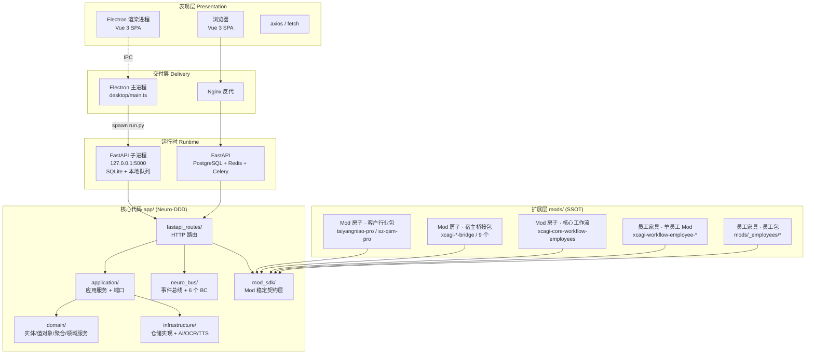
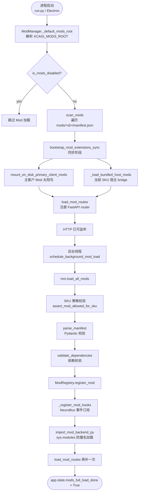
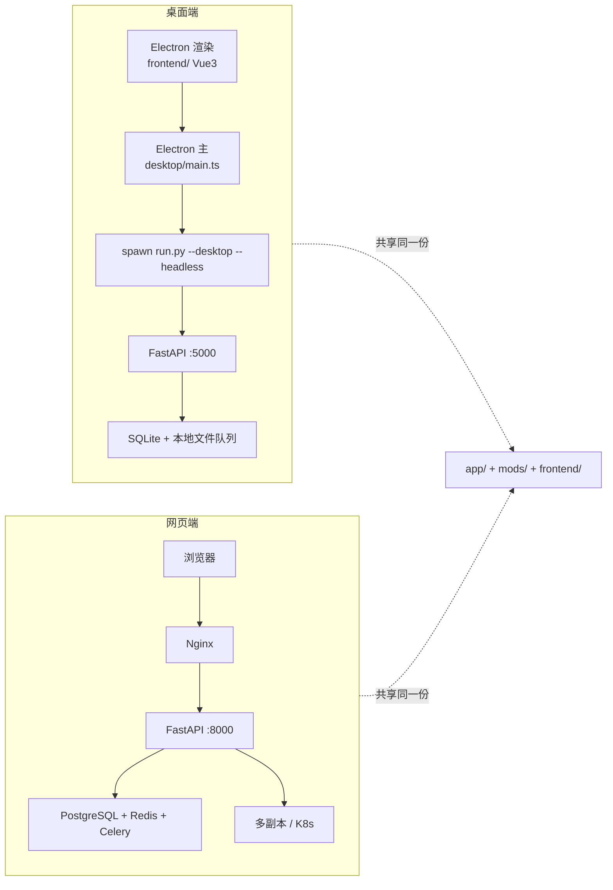
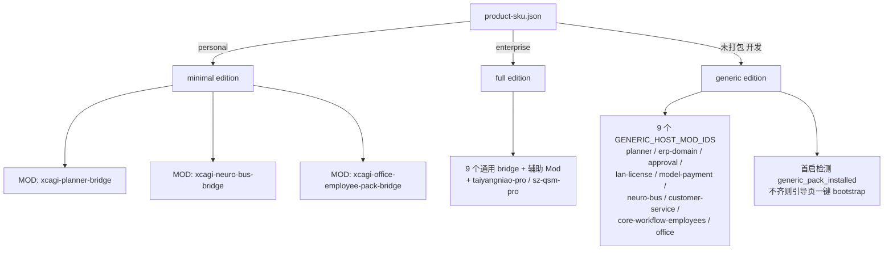

# XCAGI 企业版架构图：MOD（房子） + 员工（家具）

> 范围：桌面端 + 网页端 同一份 `app/` + `mods/` + `frontend/` 业务代码，差异只在交付形态。
> 版本：v10.0.0

---

## 一、整体分层



---

## 二、MOD 加载流水线（核心）



**关键代码**

```python
# app/infrastructure/mods/mod_manager.py
def import_mod_backend_py(mod_path, mod_id, stem):
    """按文件路径加载 Mod backend/<stem>.py 为唯一模块名。"""
    spec_name = f"_xcagi_mod_{safe(mod_id)}_{stem}"
    spec = importlib.util.spec_from_file_location(spec_name, path)
    module = importlib.util.module_from_spec(spec)
    sys.modules[spec_name] = module
    spec.loader.exec_module(module)
    return module
```

---

## 三、MOD（房子） vs 员工（家具）

> 官方定义见 `docs/guides/PLATFORM_SHELL.md` 与 `docs/guides/CORE_WORKFLOW_MOD.md`

```mermaid
flowchart LR
    subgraph MOD[Mod = 房子]
        M_DIR[mods/&lt;mod_id&gt;/]
        M_MAN[manifest.json<br/>id / backend.entry / frontend.routes]
        M_BE[backend/blueprints.py<br/>register_fastapi_routes]
        M_FE[frontend/<br/>routes.js + views/*.vue]
        M_WF[manifest.workflow_employees:...]
    end

    subgraph EMP[员工 = 家具]
        E_DEC[声明在 manifest.workflow_employees&#91;&#93;<br/>或 mods/_employees/&lt;id&gt;/manifest.json]
        E_IMP[实现 backend/employees/&lt;emp_id&gt;.py<br/>暴露 run payload ctx / status]
        E_API[HTTP: /api/mod/&lt;mid&gt;/employees/&lt;emp&gt;/run]
        E_UI[UI: 副窗"工作流员工"面板]
    end

    M_WF --> E_DEC
    M_BE --> E_API
    E_IMP --> E_API
    E_DEC --> E_UI
```

**物理形态对照**

| 维度 | Mod（房子） | 员工（家具） |
|---|---|---|
| 物理位置 | `mods/<mod_id>/` | `manifest.workflow_employees[]` 或 `mods/_employees/<id>/` |
| 数量关系 | 1 | N（一个 Mod 装多个员工） |
| 后端入口 | `backend/blueprints.py` 的 `register_fastapi_routes` | `backend/employees/<id>.py` 的 `run(payload, ctx)` |
| 前端入口 | `frontend/routes.js` + `views/*.vue` | 宿主副窗统一面板（按 `manifest.workflow_employees` 渲染） |
| HTTP 路径前缀 | `/api/mod/<mod_id>/` | `/api/mod/<mod_id>/employees/<emp_id>/` |
| 是否可独立上架 | ✅ | ❌（随房子走，或走 `employee_pack` 形态） |
| 典型样例 | `xcagi-core-workflow-employees` | `label_print` / `shipment_mgmt` / `receipt_confirm` / `wechat_msg` |

**最小完整示例**（`xcagi-workflow-employee-label-print/manifest.json`）

```json
{
  "id": "xcagi-workflow-employee-label-print",
  "name": "标签打印 AI 员工",
  "version": "1.0.0",
  "backend":  { "entry": "blueprints", "init": "mod_init" },
  "frontend": { "routes": "frontend/routes.js" },
  "workflow_employees": [
    {
      "id": "label_print",
      "label": "标签打印 AI 员工",
      "api_base_path": "employees/label_print"
    }
  ]
}
```

---

## 四、端到端请求流程（用户点击 → 业务执行）

```mermaid
sequenceDiagram
    autonumber
    participant U as 用户
    participant FE as Vue3 SPA<br/>(/mod/&lt;mod_id&gt;/...)
    participant FA as FastAPI 主 app
    participant RT as Mod blueprints.py
    participant EMP as employees/&lt;emp&gt;.py
    participant SDK as app.mod_sdk.*
    participant NB as NeuroBus
    participant SVC as Application Service
    participant DOM as Domain + Infrastructure

    U->>FE: 点击副窗"标签打印"
    FE->>FA: POST /api/mod/xcagi-workflow-employee-label-print/employees/label_print/run
    FA->>RT: register_fastapi_routes 路由命中
    RT->>RT: import_mod_backend_py(mp, mid, "employees/label_print")
    RT->>EMP: run(payload, ctx)
    EMP->>SDK: ctx.call_llm / ctx.host_base_url ...
    SDK->>NB: publish("shipment.created", ...)
    NB-->>SVC: 异步派发订阅者
    SVC->>DOM: 聚合校验 / 仓储操作
    DOM-->>SVC: 结果
    SVC-->>NB: ack
    NB-->>SDK: 回执
    SDK-->>EMP: ctx 返回
    EMP-->>RT: {success, summary, items}
    RT-->>FA: JSON 响应
    FA-->>FE: 200 OK
    FE-->>U: 副窗更新
```

**SDK 暴露的稳定面**（`app/mod_sdk/__init__.py`）

| 子模块 | 用途 |
|---|---|
| `comms` | Mod 间消息总线（register / call / get_caller_mod_id） |
| `mods_bus` | 跨 Mod 动态加载 `backend/*.py` |
| `db` / `db_models` | 受限 SQLAlchemy session 与 ORM |
| `services` | 宿主高层服务（products / ai_chat / intent） |
| `tts` / `ai_helpers` / `state` / `workspace` / `private_sqlite` / `attendance` / `audit` | 各窄能力 |
| `mod_employee_llm` | 员工窄 LLM 调用入口 |

---

## 五、桌面端 vs 网页端 形态差异



**切换变量**

| 形态 | 启动命令 | DB | 缓存/队列 | 多副本 |
|---|---|---|---|---|
| 桌面 | `run.py --desktop --headless` | SQLite | 本地文件队列 | 否 |
| 网页 | `uvicorn` / gunicorn | PostgreSQL | Redis + Celery | 是 |

---

## 六、企业版安装包构成（edition 三档）



---

## 七、关键文件定位

| 角色 | 路径 |
|---|---|
| 桌面启动 | `FHD/desktop/main.ts` |
| Mod 总管 | `FHD/app/infrastructure/mods/mod_manager.py` |
| Mod 发现 | `FHD/app/shell/xcagi_mods_discover.py` |
| Mod SDK | `FHD/app/mod_sdk/__init__.py` |
| 神经总线 | `FHD/app/neuro_bus/bus.py` |
| 业务上下文 | `FHD/app/contexts/manifest.py` |
| 特性开关 | `FHD/app/contexts/flags.py` |
| 同步启动 | `FHD/app/fastapi_app/mod_startup.py` |
| 员工包 | `FHD/app/infrastructure/mods/employee_registry.py` |
| 宿主预装 | `FHD/app/mod_sdk/host_foundation.py` |
| 概念契约 | `FHD/docs/guides/PLATFORM_SHELL.md` |
| 核心工作流 Mod | `FHD/docs/guides/CORE_WORKFLOW_MOD.md` |
| 架构总图 | `FHD/docs/ARCHITECTURE.md` |
| 桌面/网页差异 | `FHD/docs/ARCHITECTURE.md` §1.4 |
| 六线员工映射 | `six_line_employee_map.json`（仓库根） |
| 员工辐射图 | `docs/xcagi-dashboard/emp-wf-radial-graph.js` |

---

## 八、一句话总结

> **MOD = 房子**：物理上一个目录，挂到 FastAPI 主 app 的 `/api/mod/<id>/...`
> **员工 = 家具**：声明在 `manifest.workflow_employees[]`（或独立 `mods/_employees/`），实现在 `backend/employees/<id>.py` 的 `run(payload, ctx)`
> **加载链路**：扫 `mods/*/manifest.json` → 校验依赖 + SKU 策略 → 注册到 `ModRegistry` → `import_mod_backend_py` 防撞名加载 → `load_mod_routes` 挂 FastAPI → NeuroBus 订阅
> **Mod ↔ 宿主契约**：`app.mod_sdk.*` 唯一稳定面，CI 守住导入边界
> **桌面 / 网页**：同一份代码，差异只在 `XCAGI_DESKTOP_MODE` + SQLite/Postgres + 本地队列/Redis
