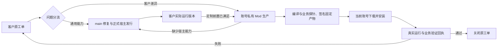

# 客户问题与交付

所有客户使用 main 发布的标准宿主。客户差异通过账号私有、独立签名和版本化的 Mod 交付；禁止按客户维护核心代码或安装包分支。

工单是全过程的记录入口。O7 保留原 ticket、租户和处理结果；客服返工也写入同一 SQL 工单和持久 outbox。通用故障走 shared_core，客户规则走 private_mod；定制缺少宿主能力时，先交付主线能力，再在同一工单启动私包生产。团队完成或 CI 通过都不能直接关闭客户工单。

私有生产源码按账号和生产轮次隔离，并与持久化工作台会话绑定；返工只取该账号上一轮的可信产物，编译签包在独立副本执行，不改原源码。私包交付需要账号、工单、生产轮次、版本、ZIP 摘要和运行文件摘要一致。公共目录仅发布明确声明 public_listing 的包；私有目录和下载返回生产中心已验收的同一份签名 ZIP，同版不同内容不可覆盖。源码同步入口不能充当正式更新源。

客户端在修改安装目录前保存交付凭证，发送“已安装”前重新验签并核对落盘内容。正在运行的包更新后等待重启，旧后端和新页面不能混用。已登录客户端每分钟及网络恢复时同步已验收的私包，每轮最多安装三个包，并重试持久回执；登录、交付页和私包页面也会触发重试。丢失响应时保留同一个回执编号、时间和业务证据。切换账号不会发送另一账号的记录。

全新定制包按原工单账号进入可发现目录；下载时事务授予实际模块权益，客户端从当前账号接口刷新会话权益后再运行。未验收、商务条件未满足、签包无效或其他账号均不授予权益。

私有 AI 员工保留原员工源码与业务处理器，打包成账号隔离的运行模块，通过工作区执行、文件下载和原业务探针完成交付；组合交付使用实际产物 ID 分别下载和验证。

业务探针实际调用已安装模块，使用合成输入并检查输出，不写客户业务数据。太阳鸟探针执行真实 Excel 转换、核对人员匹配和月度公式。未初始化工作区属于前置条件，保持等待。业务失败回到原单，自动返工有次数上限；无有效主线发行证明时不能把旧宿主异常当成私包缺陷。

通用修复通过已合并 PR、对应检查、主线包含关系和正式 OTA 签名确认版本到达；没有自动业务验证条件的工单在客服页等待客户复验，客户端不会自动代客户确认。历史已验证的签名发行元数据会保存，更新频道推进后仍可核验旧客户端。

## 发布配置

公共 Mod CI 使用 `MODSTORE_SIGNING_PRIVATE_KEY_PEM`；私有生产服务使用仓库外 `MODSTORE_SIGNING_PRIVATE_KEY_PATH`。两者必须对应宿主已信任的 Ed25519 公钥，私钥不进入源码或包。2026-09-06 生产根公钥 SHA256 为 `19e346cd1605b1f90c28cbf2ddc77d8d4fbcb6b242e24eb4e530a2e551cb3a63`，宿主保留旧根兼容已安装包。配置缺失时生产明确失败并保留原工单；不得改为不验签。服务端发布按前端锁文件准备运行模块编译器，实际运行 esbuild 原生二进制并检验输出，校验失败不切换当前发行；Node 绝对路径写入发行配置。正式宿主发行与平台签名门槛沿用现有主线发布流程。

## 持续验证

`.github/workflows/customer-delivery-e2e.yml` 在相关 PR 和 main 更新时执行跨服务测试。它使用临时账号、SQLite、临时签名密钥和独立宿主进程，检查真实打包、下载、安装、业务探针、响应丢失重试及失败返回原票。发行证明解析器另用真实 Ed25519 签名和主线包含关系测试；跨服务测试替代该外部查询，不访问生产客户。

本地从 `成都修茈科技有限公司/MODstore_deploy` 显式执行 `python -m pytest tests/sunbird_host_delivery_e2e.py`。安装该项目的 `web,dev` 依赖、pandas 和 pydantic-settings，并在 `FHD/frontend` 执行 `npm ci` 提供真实编译器。可用 `FHD_DELIVERY_E2E_PYTHON` 指定独立宿主解释器。
