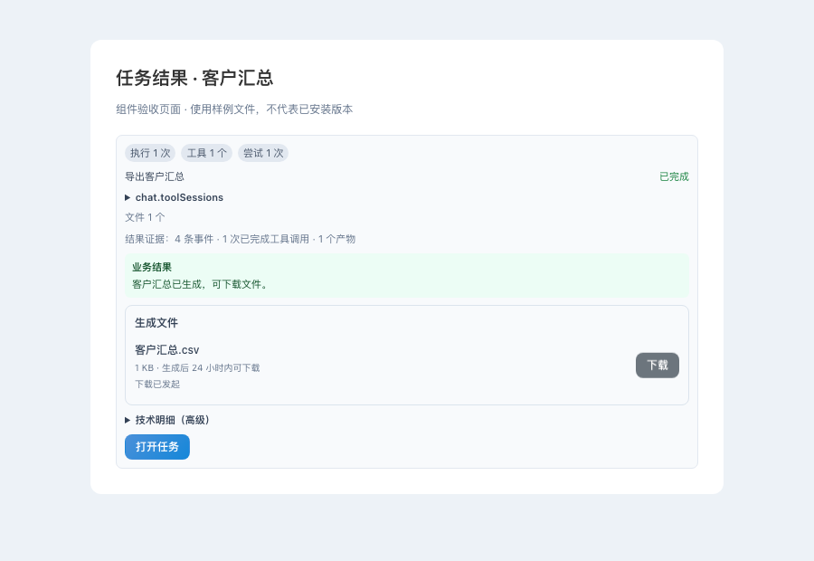

# AI 全功能控制：实施与验收记录

基线：origin/main `893a6a36d`。历史修复 PR #1784 已以
`72d26ec059b987cfb1a7ee753151b51836d4d780` 合入；模型意图兜底 PR #1801 已在基线中。

目标是四个阶段全部完成。本目录记录当前实施证据，不代表四阶段验收通过。
此前对话中的 20%–30% 覆盖率与工期只是未验证估计，不作为验收基线。

## 实测与本次改动

当前静态注册盘点为 37 类能力、194 个动作，注册项缺失分发入口为 0。
注册数量不等于业务成功率；尚未登记的 UI、API、动态 Mods 功能不在分母中。
完整结果见 `registry-inventory.json`；可运行
`python scripts/dev/ai_control_inventory.py` 重现，无需启动业务服务。

- 新增模型可调用的 `discover_erp_capabilities`，查询动作的输入、输出、权限和可用性协议。
- 能力调用接入现有 ToolSpec 参数校验，错误参数在执行前返回错误；无参数动作可省略 params。
- 计划修复禁止虚构业务参数、ID 和文件路径；缺失信息交给已有澄清流程。
- AIOPEN 不再把 401/403/404/422 或 HTTP 200 下的业务 success=false 报告为成功。
- 新增内部 software 控制能力（12 个动作），连接真实登录账号/租户的桌面会话；后台任务通过可信执行器恢复身份，客户端提交的 `_runtime_context` 不作为授权依据。
- 页面目录读取运行时路由，包含动态 Mod 页面；快照分页显示控件状态、下拉选项和只读/禁用状态，隐藏私密字段。
- 补齐选择、勾选、按键；过期页面和歧义选择器拒绝执行。单个连接串行执行命令，缓存最近 128 个完成回执以避免同 ID 重复执行。
- 回执绑定原始窗口，多窗口需明确选择；断连和超时报告失败/结果未知，不将它们当作业务成功。
- AIOPEN 增加运行时 API 目录与单操作 OpenAPI 协议读取，支持挂载路由和动态路由；目录可见性不授予执行权限。
- AIOPEN 输入调用追踪隐藏 text/typed；这不等于所有业务任务的存储已完成敏感数据治理。
- 账号切换同步断开旧控制连接，动画等待后的点击/输入再次检查账号、页面与控件；导航守卫阻断及输入被应用拒绝不再报告成功。
- 客户、产品、物料、库存、采购、销售、报表、财务、MRP、供应商、发货与导入等后台工具恢复任务租户。真实 SQLite 客户查询、更新落库和跨租户拒绝已有回归证据，其余模块仍需逐项业务验收。
- 公开任务创建、审批/恢复剥离调用方身份和内部路由标记，绑定服务端账号；执行器再次使用持久化 run.user_id。管理员恢复保留原任务所有者。
- Memory v2 新增 list/summary，完整生命周期绑定登录账号/可信执行作用域，取消模型必填 user_id；匿名、跨账号及伪造原始工具上下文拒绝。实际候选→确认→持久化重载和跨账号隔离已验证。
- 员工调用恢复任务账号与租户，拒绝参数/原始工具上下文伪造账号。线程池桥接使用上下文复制保留账号、租户和当前 Mod，子线程修改不污染父任务。员工协作 payload 的账号/会话由宿主参数覆盖。调度器将风险门/产品权限阻止视为失败。
- 模型能力调用与任务创建接口支持一次性 `scheduled_at`，强制带时区并转 UTC；任务中心审批后按原有 SQL 队列的 available_at 领取，暂停恢复不提前，取消后不领取，过期任务审批后补一次。稳定 task_id 与规范化时间共同去重，不同时间使用相同 task_id 返回冲突。任务面板显示最早执行时间。周期调度仍未完成。

## 四阶段验收状态

当前文件控制增量：新增 software.files / software.set_files 与对应 AIOPEN 工具。控制开启后保存用户原生选择的窗口内 File 引用（最多 32 个、15 分钟）；账号切换或关闭控制清除引用。模型只能使用不透明文件编号，不能指定本机路径、URL 或文件内容。AIOPEN 全部页面动作与窗口列表现已绑定服务端认证账号/租户或下述账号连接口令。

赋值前检查文件、控件、单选/多选与 accept，使用 DataTransfer 触发页面事件并回读 FileList。回执只证明文件选择，上传、ETL 落库和业务保存须另行验证。长期任务附件及全部文件入口的业务验收仍未完成。

真实 Chromium 验证原生选择、中文文件内容原样传递、一次上传事件、类型拒绝、清空与账号切换后旧编号失效（scripts/dev/check_ai_file_controls.mjs）。后端定向 106 项、前端控制定向 83 项通过；全量应用 mypy 和 3088 个 Python 文件 Ruff/格式检查通过。这是隔离测试页面证据，不是已安装软件业务验收。

| 阶段 | 已有基础与本次进展 | 尚未完成的验收 |
| --- | --- | --- |
| 1 全功能盘点与统一协议 | 注册动作清单、模型协议检索、参数检查 | 全部页面控件/API/Mods 的功能分母；逐动作分发和参数协议覆盖 |
| 2 导航、查询、CRUD、报表、ETL | 页面语义操作与结果回读；客户后台真实数据库查询/更新与租户隔离验证 | 其余各模块真实数据与界面闭环；撤销和异常验收 |
| 3 业务流程、配置、Mods、跨模块任务 | 已有持久任务、审批、恢复与工具执行器 | 所有功能接入；跨模块业务链；主机更新保持客户 Mods 权益与数据 |
| 4 记忆、主动发现、定时、自我修正、自治 | Memory v2 账号内读写、确认与持久化重载闭环；已有员工 scheduler、repair advisor | 员工身份及跨模块贯通；暂停/恢复/去重；真实业务故障恢复与持续运行验收 |

不得通过开放任意内部接口、绕过鉴权、生成参数占位值或把注册成功当执行成功来补足覆盖率。

源码入口对账已扩展至注册表以外，见 [候选入口报告](source-surfaces.md) 与 `source-surfaces.json`。扫描 4032 个受版本控制的 FHD 源文件，包含 1715 个 API 声明、116 个前端路由声明、2047 个 Vue 事件绑定、33 个文件输入候选和 103 份 Mod 清单副本，无解析错误。数字包含源码/发布副本且不证明运行时挂载或账号授权；865 个 API 声明的路径或前缀仍有静态不确定性。原生端、外部后台、第一方 packages 与动态生成入口仍需补齐。8 项扫描器回归通过，源码及扫描器哈希随报告保存。文件控件通用链路已新增，候选位置仍需逐项对照专用导入工具和实际业务结果验收。
微信动作现已接入分发：查询读取租户内的宿主同步数据；刷新使用下述请求与回执链路。真实 Windows 采集验收仍未完成，不能把分发入口存在视为业务完成。

微信接入核查：已定位 `tools/wechat_sync/wechat_sync.py` 的 Windows 实际采集代理及 `/api/ops/wechat/ingest` 回流链路，但刷新动作尚无请求/领取/结果回执协议。本批先修复 AI 上下文无租户时读取全局联系人的行为，拒绝空值、非法值、布尔值、浮点值和非正租户；联系人关联客户、消息和数量均约束到联系人所属租户，人工绑定按指定租户选择联系人并拒绝跨租户客户。32 项摄取/上下文回归通过，包括同名跨租户联系人、错误关联和异租户消息混入的真实 SQLite 测试。此批不代表微信刷新已执行，也不代表该能力已完整接入。

微信执行增量：新增宿主 SQL 刷新请求、按租户领取的 CAS 租约和幂等回执，接通 Windows 代理守护循环。联系人刷新不读取消息；消息刷新上行成功才保存游标；采集失败不再变成空数据成功。AI 等待最多 10 秒，离线/等待/过期均不报告业务完成，并提供回执查询编号和重试幂等键。账号内状态查询、异租户/异账号拒绝、过期租约、并发领取、冲突回执和迁移重复执行都有回归。人工绑定 HTTP 路由也已传递租户，避免只修服务而入口丢失筛选条件。

该批注册/协议/后台执行/微信定向回归 172 项通过，执行器贯通测试覆盖注册分发、真实 HTTP 摄取、SQLite 持久数据及回执；仅 Windows 数据库读取由样例替代。刷新请求在 15 分钟后过期，单次领取租约为 5 分钟；真实设备和长耗时采集仍需验收。静态清单 37 类/192 个动作当前缺失分发入口为 0，但全软件覆盖率仍为未知；未登记 UI/API/Mods 和业务验收不包含在这个分母中。

执行器贯通改造后对应 10 项复验通过；应用全量 mypy 无错误，3050 个应用/测试文件格式检查和架构适应性检查通过。后续已接入后台协作等待：前台仍限 10 秒，后台在请求剩余有效期内等待，由原步骤接收晚到回执并持久化完成。等待占用后台槽位并服从持久暂停/取消；恢复复用原请求与原步骤审批，中断退款且不生成业务失败观察。暂停中的过期采集租约不得重新领取。实际 SQLite 任务账本测试覆盖晚到回执、暂停恢复、取消、请求过期和净计费一次；计费接口为测试替身，真实账单及 Windows 实机仍待验收。

该次任务分发/协议/微信回归 47 项通过，随后微信/编排/路由快照 39 项通过。CI `c73088435` 暴露冷启动循环导入、services 文件数棘轮、路由快照遗漏及 schema 漂移脚本导入路径问题：适配器已移到 application 且延迟导入编排身份；补上两条真实刷新路由快照；先设置脚本模块路径再导入 app。冷启动子进程、schema 迁移全链无漂移与分层棘轮本地复验通过，新提交仍需完整 CI。

集成分支已同步正式主线 `455223967`（PR #1785 的共享主机与签名客户 Mod 交付改动），没有引入其他未合并工作树。组合版本的任务/路由回归 45 项、跨服务签名 Mod 交付 4 项通过，全量应用 mypy 无错误、3087 文件格式检查、全部 dev guards 和工作流源/副本漂移检查通过。该组合尚未合入 main，也未构建或安装交付制品。

## 验证

此前 25 项能力注册/分发与 64 项编排/调度回归通过。本轮账号身份、API 协议、窗口回执、AIOPEN 服务/路由、追踪脱敏、能力协议与编排定向回归合计 298 项通过；页面控制及命令排队回归 74 项通过。前端类型检查、触及文件 ESLint/Ruff 与架构适应性检查通过。
这些是本地行为回归，不是全部功能的业务验收，也不证明已安装版本包含变更。
集成 PR #1804 为草稿，尚未合入主线。旧提交的全量后端检查为 36908 通过、1 失败、63 跳过；失败是旧测试仍期待 HTTP 499 成功，本轮已纠正，需由新提交 CI 重新确认。
CI、主线合并以及从主线构建并核对运行 UI/后端身份仍需完成。

后续增量：账号/后台业务/记忆等定向套件 414 项，前端操作套件 78 项；全量 `mypy app/ --no-error-summary --no-incremental` 通过。旧提交 `5cdb851b5` 的 backend-test 停在新校验文件的两处类型收窄错误，本轮已修复并本地复验；新提交 CI 尚需确认。测试数字不能累加为功能覆盖率。

员工增量：执行账号/线程上下文/调度及相关编排回归 392 项通过；提取公共异步桥接后对应 145 项复验通过，另有 agent runner 和员工编排 77 项通过。线程上下文传递不证明持久任务已捕获并恢复原 Mod，也不证明按账号的持久定时调度已经完成。

离线平台验收 120/120 通过（含工具替身，不是 120 项真实客户业务验收）。记忆路由评测显式提供已验证会话；SQL 导入样例使用合法正整数租户，非法租户拒绝测试保留。本地评测使用隔离临时数据目录和当前工作树的 vendored LangGraph 源码，未绕过来源断言。

一次性调度增量：36 项调度/队列/任务路由回归通过，包含实际 SQLite 重新建立仓储后领取、暂停恢复、取消、到期去重，以及模型创建待审批任务而不执行工具。前端类型检查和触及文件 ESLint 通过。该证据不证明周期调度或已安装桌面端验收。

周期调度增量：新增宿主 SQL 表和 Alembic 迁移，支持 interval/daily（IANA 时区，午夜、夏令时缺失/重复时刻有明确策略）。模型 `execute_erp_capability` 可创建，`manage_erp_schedule` 可查询/暂停/恢复/取消，任务中心新增列表与控制。原 dispatcher 每秒发布最多一个到期任务；持久租约与固定发生时间生成稳定任务 ID，旧租约回执拒绝，停机补一次，未完成任务不累积。每次仍经任务中心审批，**尚未实现周期授权后的自动业务执行**；控制只影响后续触发，已生成任务独立保留。

周期仓储、API/模型、队列和注册定向回归 57 项通过；真实 SQLite 重载与双线程争抢、回执丢失重试、取消不复活、跨账号拒绝、迁移重复执行及实际 dispatcher 线程生成待审批任务均有测试。周期面板/全局任务中心 4 项通过，前端类型检查、ESLint、Ruff、全量应用 mypy 与架构适应性检查通过。已安装桌面 UI 尚未验收；持久任务捕获原 Mod 和自动周期授权仍属剩余范围。

## 明确剩余范围

Mod 作用域增量：创建任务绑定服务端当前模块和已验证的会话记录编号，不保存会话令牌；执行前重读宿主账号/会话/权益，恢复 Mod 后访问业务仓储并在结束时复原线程上下文。用户提供的 mod_scope/active_mod_id 等字段不作为授权。账号停用、会话过期、权益撤销、租户变更或伪造作用域拒绝执行。实际分开的 SQLite 库验证客户查询/更新只落目标 Mod，其他 Mod 不变。

Agent 账本与执行队列改用 HostSessionLocal。访问仍有旧账本的 Mod 时，事务复制历史到宿主；不删除原库、不覆盖宿主已有记录，冲突拒绝且不会退化为空内存仓储。旧待执行任务暂停等待原账号重新确认；旧队列已领取或运行中任务标记结果未知且禁止重试。该迁移按当前 Mod 访问触发，尚未完成所有历史 Mod 的统一枚举验收；退役 Mod 映射、未知结果业务对账和长期周期计划跨会话续授权仍需贯通。

此批 Mod/业务租户/员工/调度/路由定向回归 67 项通过，迁移模块更名后 10 项复验；全量格式检查 3046 文件通过，应用 mypy 无错误。架构检查最初拒绝 legacy_ 文件命名，改为 mod_journal_migration 后通过。未修改已安装软件和生产数据。

上一提交的前端 CI `34199959402` / job `101976246848` 在 npm 安装 onnxruntime-node 时下载 Linux GPU 包遇到 ECONNRESET，测试尚未开始；新提交需重新完成该门禁，不能将网络安装失败算作测试通过。

周期授权增量：新增限时、限次且绑定具体动作/参数/周期和 ToolSpec 权限范围的授权及逐 run 额度预留记录。用户在任务中心查看操作并确认，模型创建计划本身不授予自动执行权限。授权内任务使用原任务队列执行；执行前再次核对计划状态、授权有效性、动作参数与账号活动/租户。暂停、取消、撤销、过期和次数耗尽均有对应路径；待审批任务续授权或恢复后可重新入队。记录中的次数是已批准任务数，不是业务成功数；已开始的操作不承诺强制中断。

该增量后，调度/授权/任务中心后端定向回归 66 项、前端 6 项通过，包含真实 SQLite 并发额度上限、授权撤销/续期、队列到编排执行以及迁移重复执行。执行器使用测试替身，不能作为全部业务动作验收。此前“尚未实现周期授权自动执行”的记录属于旧提交阶段，当前已补机制与回归；已安装桌面端、全部业务功能与 Mod 作用域仍未全量验收。

旧提交 `08e60ff45` 的 CI `34198194272` 在 `ruff format --check app/ tests/` 停止，原因是 `recurring_schedule_service.py` 需要格式化；本批修复并本地全量检查 3043 个文件通过。新提交仍需完整 CI，不能将该格式修复描述为全量后端验收通过。

- 完整功能分母：逐页面/API/授权 Mod 对账，补齐缺失 dispatcher，不能用 192 个注册动作冒充全软件覆盖率。
- 控件与身份：文件上传、复杂自绘控件，以及旧外部 AIOPEN 通道的身份策略仍需核验；账号切换连接和在途命令已补回归。
- 业务结果：导航/点击回执只证明交互层结果；各模块持久化读取、权限隔离、撤销和异常补偿需真实数据闭环。
- 任务与自治：跨模块任务、配置和 Mod 更新；员工执行身份、主动发现、调度、去重、暂停恢复和故障修复需按账号贯通验证。长期记忆单模块闭环已验证，跨模块自动使用仍需验收。
- 交付：同一集成 PR 必需检查通过、合入 main、精确提交构建、安装后 UI/后端/Mod 权益核对。

## 当前增量：外部 AI 账号连接口令

面板发放的运行时口令绑定真实登录账号、租户、宿主会话记录与会话摘要，不存储登录口令。有效期为原会话到期与 24 小时中的较早者，进程重启需重新生成。每次使用重读宿主 SQL：停用、租户变更、会话过期/删除/替换或撤销均失效。显式提供无效或共享环境口令时不得回退到浏览器另一个账号。原无账号绑定的口令不能控制屏幕。

全部外部页面动作、窗口列表、控制面板历史与钥匙列表按账号和租户隔离；同租户其他账号也不可操作。只有口令所属账号可以撤销；生成/撤销审计使用实际账号。公开接入说明同步账号口令要求和动态工具数量。共享环境口令不授予账号权限；后续账号连接口令的业务 API 执行贯通见下节。

AIOPEN/路由/协议/隐私/软件控制扩大回归 289 项通过；随后账号正整数边界新增后 24 项复验通过。真实 SQLite + HTTP/MCP 覆盖口令发放、撤销、当前会话有效性、跨账号列表与操作拒绝、实际控制命令回执和面板历史隔离。全量应用 mypy 无错误，3090 个 Python 文件 Ruff/格式检查通过。未构建或安装交付制品，四阶段仍未验收完成。

## 当前增量：业务 API 真实身份与请求协议

api_call 现使用已验证的本机登录会话或账号连接口令恢复登录身份，不接受模型提供的认证头/账号/租户作为权限来源。会话只在进程内发往目标 ASGI 应用，不出现在工具回执中；实际接口继续执行登录和角色权限检查。目标请求由真实行业中间件解析租户，清除继承的租户覆盖；mod_id 省略继承当前请求，空字符串选择宿主，指定模块重验会话权益，结束后恢复原上下文。当前登录请求的教学 Cookie 保留给原中间件验证，账号口令不继承其他浏览器账号的 Cookie；有效教学任务的完整业务验收仍待完成。

调用只接受本机路径，拒绝目录跳转、异常编码/控制字符及外部 URL；不跟随重定向。白名单按最长匹配执行，关闭的子路径不再被父前缀重新放行。保留原 CSRF 流程并关闭临时客户端。JSON 请求体按原值发送，支持数组、标量和 null，包含 DELETE/显式 GET 请求体；不再自动插入 source 字段（chat 自己明确提供 source）。非 JSON 数值/对象拒绝执行。

314 项 AIOPEN、协议、路由与软件控制回归通过，其中 22 项新执行回归使用真实宿主 SQLite 会话、实际 HTTP 资料/客户路由、生产行业/CSRF 中间件与客户服务。已验证外部 REST 到受保护资料接口、客户读取与更新落库、跨租户更新 404、管理员接口 403、Mod 权益撤销与独立数据库隔离、过期登录拒绝、上下文恢复、JSON 原样传递及重定向拒绝。Mod 数据库由隔离测试工厂提供，不等于实际安装 Mod 验收；客户新增/删除/回滚和其他业务模块仍需逐项闭环。全量应用 mypy 无错误，3092 个 Python 文件 Ruff/格式检查通过。

当前仍需补齐原生端/动态入口与功能分母、附件/二进制导出/流式 API、各业务模块和长期自治验收，以及 CI、main 合并、精确主线制品与安装端核验。此批不代表四阶段完成。

## 当前增量：导出文件与下载回执

API 返回的附件、二进制、CSV 和长文本现保存完整字节，不再截成 2000 字符后报告完整交付。私有目录位于 get_data_dir()/aiopen-private-artifacts，下载通过独立 /api/aiopen/artifacts/{artifact_id} 路由，返回文件名、大小、SHA-256、到期时间和认证下载 URI。回执同时进入任务 artifact，任务归属取真实 API execution_scope，不能由请求体伪造。

读取先核验当前账号、租户和 Mod 权益，再检查文件大小与哈希；跨账号、权益撤销、过期、损坏、非法编号和符号链接拒绝。响应强制附件下载、private/no-store 和 nosniff。当前每文件保存上限 64 MiB，有效期 24 小时；同账号下次导出时只清理其已过期回执与文件。当前响应仍先缓存在内存，未实现大文件流式限流、集群共享存储或全部历史孤立文件清理，不能据此宣称这些验收通过。

实际生成 XLSX 经 API、私有文件存储、认证 HTTP 下载后，字节/哈希一致，重新打开可读出中文客户名与数值。模块重载后回执仍可读取；同时验证了未标注类型的二进制、CSV、长文本、过期清理、损坏/超限拒绝及真实任务 artifact 归属。扩大回归 317 项通过；补充回执与边界并拆分路由后，相关 75 项复验通过。旧路由文件超过 500 行的架构守卫问题已通过独立下载路由解决，全部 dev guards、全量应用 mypy、3095 个 Python 文件 Ruff/格式检查通过。实际安装端 UI 下载、真实客户导出业务和长期运行仍需验收，四阶段目标保持未完成。

导出回执后续复验：改用真实 SQLite 任务仓储并重新实例化仓储读取，文件 URI、SHA-256、实际账号与租户均保留；相关 8 项通过。此验证不等于安装端页面已展示或客户已下载。

## 当前增量：任务结果直接下载

聊天任务结果卡现直接展示私有导出文件、大小、有效期与下载按钮。仅接受编号一致的认证下载回执，沿用现有登录客户端；拒绝重定向，并检查大小、服务端摘要与可用时的浏览器 SHA-256。重复点击不会重复请求，90 秒超时可重试；账号切换、组件退出或回执移除会中止旧请求，相同任务轮询不会误取消下载。提示“下载已发起”，不将浏览器保存动作当作已经落盘。

24 项前端回归通过，包含拒绝后重试、过期、损坏文件、重复点击、超时与账号切换；全量前端类型检查、触及文件 ESLint 和 10 项阻断 dev guards 均通过。真实 Chromium 使用实际任务组件、API 客户端和下载工具，验证认证 Cookie、中文文件名、下载字节一致及账号切换中止旧下载，页面无脚本异常。验收脚本为 scripts/dev/check_ai_artifact_download_ui.mjs。

图片来自隔离样例页面，不代表已安装软件。实际客户导出、全部历史附件类型、主线交付与安装端验收仍未完成；四阶段目标保持进行中。

## 当前增量：表单、multipart 与 ETL 实际后端闭环

api_call 新增 form 与 files 协议。表单值保持字符串、重复值和空值，不自动转换业务参数；body 与表单/附件互斥。multipart 仅引用已有私有导出回执，逐个重新核验文件账号、源 Mod 权益、到期、大小与哈希，目标接口仍执行当前会话和目标 Mod 权限。最多 16 个附件、合计 64 MiB；不允许模型指定文件系统路径、外部 URL 或内联文件内容。用户新上传附件的持久接入和大文件流式处理仍需完善。

表单及既有 API 身份/导出定向 50 项通过，其他 AIOPEN 回归 245 项通过。实际 FastAPI multipart 解析验证中文 XLSX 完整字节、重复文件字段与表单值；无权、过期、损坏和超额附件未调用目标处理函数。全量应用 mypy、Ruff 和格式检查通过，10 项阻断 dev guards 全通过。

另新增真实 ETL 后端贯通验收：私有导出文件 → /api/etl/uploads → 客户预演 → 明确 confirmed 后执行 → 客户列表读取 → 重复导入零新增 → 原运行撤销。使用真实 SQL 会话、接口权限、生产行业/CSRF 中间件、XLSX 解析器、ETL 服务及后台线程，数据库工厂、文件目录和工作线程池使用隔离测试资源；测试账号具有管理员角色，桌面登录许可探针与动态客户 Mod 分发使用已有测试接缝，行建议器使用内置确定性降级。200 条样例客户在预演前后不写入，执行后本租户从 1 条变成 201 条，重复执行保持 201 条，撤销后恢复 1 条；同租户其他账号和异租户不能读取或执行该运行，另一租户原数据不变。此证据不证明安装端 UI 或全部 ETL 目标验收通过。

该阶段核查曾发现旧 /api/customers/import 路由引用缺失的 run_customers_excel_import_bytes，旧覆盖测试以替身返回成功；/api/customers/export 兼容路由仍明确返回 501。这两个旧入口的后续修复见下一节；实际部署和安装端仍待验收，不能因通用 API 协议接通而标记完成。当前工作仍在同一集成 PR #1804，未合入 main 或更新已安装软件。

该批统一重跑上述 AIOPEN 与 ETL 贯通套件共 296 项全部通过；新增业务验收后 10 项阻断 dev guards 复验通过。

## 当前增量：客户页导入、导出与 Mod 预演作用域

客户文件接口现复用既有服务：/api/customers/import 创建 ETL 上传和预演并返回 202、run_id、requires_confirmation，保留企业版与 etl.execute 权限及客户写入检查；不调用已缺失的旧函数、不直接写客户。客户页取得有效回执后打开 /business-docking?run_id=…，待用户核对再确认写入。没有回执的 success 不显示导入成功，账号切换后的旧响应不跳转。

客户导出连接已有 CustomerTransferMixin.export_to_excel，并将文件路由注册在 customer_id 路由之前，消除原路径被动态 ID 路由抢先匹配的问题。导出显式约束当前租户、保留电话前导零，将业务字段中的公式样式文本作为文本写出；文件名增加 UUID，连续或并发导出不共用同一个秒级文件名。指定模板不可用时明确失败，不能静默换成默认模板。客户页提供“标准客户清单”选项，并在账号切换后阻止旧下载落到浏览器保存流程。

ERP 门面 Mod 通过显式宿主 SDK customer_exchange_router 挂载相同文件接口，源码与 XCAGI 副本同步升级为 1.0.0.1。初次直接导入宿主路由被 Mod 边界守卫拒绝，已改成 SDK 导出并通过守卫。预演与执行线程用 copy_context 保留提交时的 Mod 上下文，解决工作线程默认访问宿主而找不到 Mod 运行的问题；这不证明重启后恢复或执行期间权益变更已经全量验收。

客户服务/路由与真实数据贯通 169 项通过；扩大 AIOPEN/ETL 预演、操作租约和执行回归 183 项通过、14 项 PostgreSQL 用例因未配置独立 ETL_TEST_POSTGRES_URL 跳过。实际宿主和 Mod 接口均通过 XLSX 附件创建 200 行客户预演；预演不写入，确认后只有目标库从 1 条变为 201 条，其他 Mod 与宿主保持原值。导出实际工作簿验证租户范围、唯一文件名、电话文本、公式样式文本和缺失模板拒绝。路由快照 36 项通过，前端 14 项通过，全量前端类型检查、应用 mypy、Python Ruff/格式及 10 项阻断 dev guards 通过。测试使用隔离 SQL、样例文件和已有登录/桌面许可测试接缝，不涉及真实客户数据。

尚未构建或安装该 Mod 版本，旧已发布客户端、模板完整样式、安装端点击与新入口整链仍需验收。私人客户 Mod 的自定义文件路由必须另行对账；不能用通用 ERP 门面改动替代全部客户 Mod 完成。四阶段目标仍未全部完成。

## 当前增量：隐藏接口协议与 HTTP 方法对账

api_operations 现包含普通 Starlette HTTP 路由，并按 schema_available 明确区分类型化 API 和没有请求协议的 HTTP 入口。普通路由只报告已挂载的方法，不虚构参数。隐藏于公开 OpenAPI 的 FastAPI 动作可按需读取协议：在私有副本中保留真实挂载前缀、依赖参数和模型字段，只为该次协议查询开启 schema；原路由和公开 OpenAPI 不变，业务处理器与依赖均不执行。

api_call 增加 HEAD/OPTIONS，与发现工具的方法列表一致。未显式提供请求体时发送空请求体；HEAD 只返回明确允许的响应元数据，不把附件响应头误认为已下载文件，不回传 Set-Cookie 或任意内部令牌头。权限、Mod 与路径检查继续使用原执行链。

AIOPEN 扩大回归 299 项通过；补充 HEAD 头部脱敏后相关 36 项复验通过。真实 HTTP 验证 HEAD/OPTIONS 执行及无伪造导出，嵌套路由测试验证隐藏协议、依赖参数和公开 OpenAPI 不变。全量应用 mypy、3100 个 Python 文件 Ruff/格式检查与 10 项阻断 dev guards 通过。这些证据仍不构成全软件功能分母或全部已安装业务验收；无类型化协议的入口还需补充正式契约或专用适配器。
