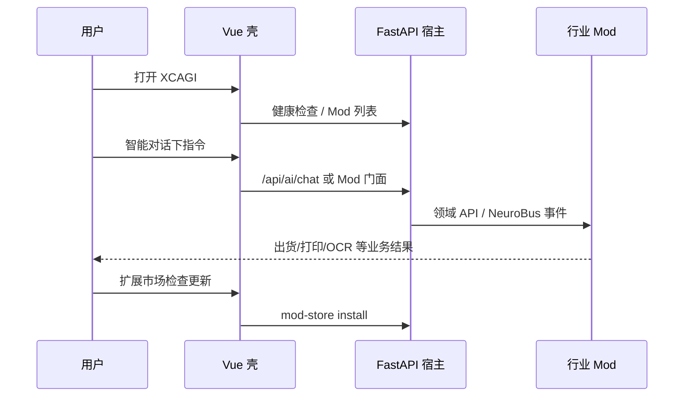

# XCAGI 产品用户流程（可交付宿主）

> **读者**：客户实施、技术支持、产品经理、前端/后端开发。  
> **模型**：每家客户一份**独立宿主**；装平台 **MOD** 后变为该客户的垂直系统；数据在客户本机。

> 三端协同、手机绑定、AI 员工通讯录、超级员工 Codex、流程可视化的产品级验收，见 [PRODUCT_POLISH_CHECKLIST.md](./PRODUCT_POLISH_CHECKLIST.md)。

---

## 一、流程总览（5 个阶段）


| 阶段 | 用户感知 | 系统行为 | 完成标志 |
|------|----------|----------|----------|
| **0 安装** | 运行安装包 | 释放 Electron + 后端 + 内置 `mods/` 种子 | 桌面出现 XCAGI 图标 |
| **1 首次启动** | 开屏 → 登录（若启用） | 后端子进程、SQLite、种子复制到 userData/mods | 进入引导或主界面 |
| **2 宿主就绪** | 引导页「宿主能力包」 | 检测 9 个 generic bridge Mod；可一键 bootstrap | `deliverable: true` |
| **3 行业定型** | 扩展市场装行业 MOD | 侧栏出现行业菜单；API/页面由 Mod 提供 | 客户自选，可跳过 |
| **4 日常使用** | 智能对话 + Mod 菜单 | 壳模式侧栏；业务在 Mod 路由 | 持续运维 |

---

## 二、阶段 0：安装（客户侧）

### 2.1 输入

- Windows：`XCAGI-Setup-8.0.0.exe`（generic 壳构建）
- 可选：`tools/XcagiDownloader.exe`（更新仓下载）

### 2.2 系统写入

| 位置 | 内容 |
|------|------|
| 程序目录 | Electron 壳、打包后端 `_internal/`、**内置 `mods/`**（只读种子） |
| `%APPDATA%\XCAGI\`（或 macOS/Linux 等价路径） | 空 `data/`、`mods/`、`logs/` 等待首次启动填充 |

### 2.3 验收

- 安装无报错；卸载项中存在 XCAGI。
- **不**要求此阶段已有业务数据。

---

## 三、阶段 1：首次启动

### 3.1 屏幕序列

```text
[开屏 Splash]  →  （可选）[登录]  →  [首次设置 /onboarding]  →  [主界面]
```

| 步骤 | 路由/界面 | 说明 |
|------|-----------|------|
| 1.1 开屏 | `App.vue` 启动遮罩 | 拉取 `/api/mods/loading-status`；最长约 12s 兜底 |
| 1.2 会话 | `/login` | 若 `authApi.validateSession` 失败则跳转登录 |
| 1.3 局域网 | `/lan-gate` 或弹窗 | 仅企业启用 LAN 许可时；见 `useLanGate` |
| 1.4 引导 | `/onboarding?step=…` | **generic/minimal 构建且未完成引导时强制进入** |

### 3.2 后端并行（lifespan）

1. 初始化 SQLite（桌面 `userData/data/xcagi.db`）
2. `seed_edition_mods_from_bundle`：内置 mods → 用户 `mods/`
3. `load_all_mods` + 挂载 Mod HTTP 路由
4. `build_deliverable_status` 写入 `app.state.deliverable_status`

### 3.3 异常分支

| 现象 | 用户操作 | 技术处理 |
|------|----------|----------|
| 开屏超过 12s | 可点跳过 | `STARTUP_FAILSAFE_MS` 强制进主界面 |
| 后端未起 | 重试或看日志 | `%APPDATA%\XCAGI\logs\` |
| LAN 403 | 管理员放行 IP | `/api/platform-shell` 已加入 bypass 前缀 |

---

## 四、阶段 2：宿主就绪（引导步骤 1～2）

### 4.1 界面：`/onboarding`

| 步骤 ID | 标题 | 用户动作 | 接口 |
|---------|------|----------|------|
| `welcome` | 认识宿主 | 阅读说明 → 下一步 | — |
| `host-pack` | 宿主能力包 | **一键装齐通用包** / 重新检测 | `GET deliverable-status`、`POST bootstrap-edition-pack` |

### 4.2 宿主包内容（generic）

必须装齐的 Mod id（见 `GENERIC_HOST_MOD_IDS`）：

- `xcagi-planner-bridge` — 对话入口  
- `xcagi-neuro-bus-bridge` — 事件总线门面  
- `xcagi-erp-domain-bridge` — ERP API 门面  
- `xcagi-core-workflow-employees` — 核心工作流员工  
- `xcagi-approval-bridge`、`xcagi-lan-license-bridge`、`xcagi-model-payment-bridge`  
- `xcagi-office-employee-pack-bridge`、`xcagi-customer-service-bridge`  

### 4.3 完成判定

```http
GET /api/platform-shell/deliverable-status
```

当 `data.deliverable === true` 且 `generic_pack_installed === true` 时，阶段 2 完成。  
本地标记：`localStorage.xcagi_product_flow_host_ack = 1`。

---

## 五、阶段 3：行业定型（引导步骤 3，可跳过）

### 5.1 业务含义

- **宿主** = 空壳 + 通用 bridge（阶段 2）  
- **行业 MOD（L2）** = 中性行业包（如 `coating-industry`）；enterprise 安装包内 `industry-seeds/` 只读池，**选行业后单拷**到 userData/mods  
- **账号定制（L3）** = `sz-qsm-pro` 等；不进安装包，entitlement 通过后 Catalog 安装  
- 装行业 MOD 后：侧栏菜单、首页、员工卡、行业词汇由 Mod 的 `manifest` 驱动  

### 5.2 界面路径

| 用户选择 | 跳转 | 结果 |
|----------|------|------|
| 一键装齐本行业推荐项 | `/onboarding?step=host-pack` | L1 host-foundation + L2 industry-seed + L3 定制（若有 entitlement） |
| 打开扩展市场 | `/mod-store` | 浏览 Catalog → 安装 → 刷新 Mod 列表 |
| 先使用对话 | `/` 或 planner Mod 对话页 | 仅通用能力；稍后可再装 MOD |

### 5.3 安装 MOD 后系统变化

1. `ModManager.load_mod` 挂载 `/api/mod/<id>/…` 与前端 `registerModRoutes`  
2. `applyEditionPackPlatformShell` 或行业 Mod 的 `menu` 注入侧栏  
3. `industry` / `ui_labels` 覆盖界面用词（见 `manifest.industry`）  

完成引导：`localStorage.xcagi_product_flow_completed = 1`。

---

## 六、阶段 4：日常使用

### 6.1 壳模式侧栏（generic 默认）

固定入口（`SHELL_CORE_MENU_KEYS`）：

| 菜单 | 路由 | 用途 |
|------|------|------|
| 智能对话 | `/` → 常重定向到 planner Mod | AI 指令与工具 |
| 扩展市场 | `/mod-store` | 装/卸/更新 MOD |
| 设置 | `/settings` | 壳模式、行业、账户等 |
| 员工空间 | `/workflow-employee-space` | 工作流员工 |
| Mod 菜单 | `/mod/<id>/…` | 由已装行业 Mod 注册 |

**不**在壳模式显示宿主内置 ERP 页（产品/出货等）；访问旧路径会重定向到 Mod 或对话页。

### 6.2 典型日流程



### 6.3 升级与运维

见 [customer/CUSTOMER_SUPPORT.md](../customer/CUSTOMER_SUPPORT.md)：备份 userData → 安装新版本 → 验证 `deliverable-status`。

---

## 七、角色与责任边界

| 角色 | 做什么 | 不做什么 |
|------|--------|----------|
| **供应商（你）** | 发宿主安装包、平台 MOD、文档与验收脚本 | 不托管客户业务库、不代登录客户系统操作 |
| **客户 IT** | 安装、备份、局域网/LAN 策略 | 一般不改宿主源码 |
| **客户业务用户** | 对话、业务页、扩展市场装 MOD | 不区分宿主/Mod 技术细节亦可 |

---

## 八、与代码的映射

| 流程环节 | 前端 | 后端 |
|----------|------|------|
| 引导页 | `ProductOnboardingView.vue`、`useProductFlow.ts` | `deliverable-status`、`bootstrap-edition-pack` |
| 路由守卫 | `router/index.ts` `beforeEach` | — |
| 首启种子 | — | `desktop_deliverable.py`、`edition_policy.seed_*` |
| 壳模式 | `platformShellMode.ts`、`MainLayout` + `Sidebar` | `platform_shell.py` |
| 可交付验收 | — | `scripts/dev/deliverable_smoke.ps1` |

---

## 九、验收检查表（实施人员勾选）

- [ ] 新装后首次打开进入 `/onboarding`  
- [ ] 步骤 2 检测通过后 `deliverable: true`  
- [ ] 完成引导后进入对话，侧栏无内置 ERP 杂项（generic 壳）  
- [ ] 扩展市场能列出 Catalog 并成功安装至少 1 个 Mod  
- [ ] 安装行业 Mod 后出现 Mod 菜单项  
- [ ] 重启应用后不再强制进入引导（除非清除 `xcagi_product_flow_completed`）  
- [ ] 客户数据仅位于本机 userData  

---

*配套：[DELIVERABLE_PRODUCT.md](../DELIVERABLE_PRODUCT.md)、[PLATFORM_SHELL.md](./PLATFORM_SHELL.md)、[ADCDFG_COMPLETION_PLAN.md](./ADCDFG_COMPLETION_PLAN.md)*
