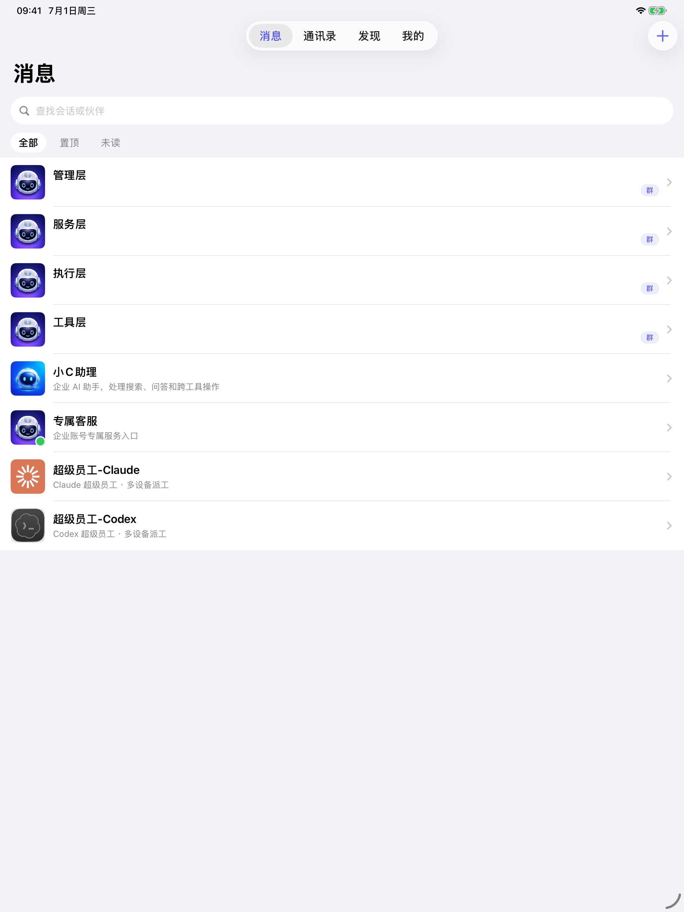

  

<h1 align="center">XCAGI · AI 员工桌面平台</h1>

  <b>面向中小企业的私有化桌面 AI 工作平台</b> —— 本地 ERP + 可插拔 AI 员工 + 行业 Mod 商店，让重复的业务工作交给"AI 员工"，数据装在自己企业里。

  <a href="https://xiu-ci.com"><b>📦 下载桌面版</b></a> ·
  <a href="https://xiu-ci.com/download">🖥 在线体验</a> ·
  <a href="https://docs.xiu-ci.com">📖 使用文档</a> ·
  <a href="https://xiu-ci.com/contact">📮 联系我们 / 预约演示</a>

  
  
  
  
  

---

## 它能帮你做什么

XCAGI 把分散在几个系统里的业务工作整合到一个桌面上，并让 AI 承担其中的重复部分：

- **一句话派活** —— 用日常语言告诉 AI 员工"该做什么"，它把目标拆成可执行任务并交付结果，而不是让你逐个操作软件。
- **装个 Mod 就变成你的行业工具** —— 制造业 / 园区 / 贸易等行业能力以 Mod 方式插拔，不用重开一套 ERP，按需购买、授权、更新。
- **数据装在自己本地** —— 业务数据保存在企业内部，不依赖云端，适合对数据安全和隐私有要求的企业；SSO 与账号权限统一管理。
- **手机也能批** —— 审批 / 通知 / 聊天通过移动端跟随，老板在外也能处理流程。

连续成立的诉求：把考勤、客服、销售与生产协同放到同一桌面，**对话下达目标，AI 员工协作并交付可验收的结果**。

## 核心能力

| 本地部署 & 数据隔离 | AI 员工原子化编排 | 行业 Mod 商店 |
|---|---|---|
| 桌面宿主 + 本地 ERP，企业数据不出本地，离线可用 | 用自然语言编排多个 AI 员工协同完成业务流程 | 行业能力以 Mod 插拔，含授权、支付、下载、自动更新闭环 |

## 谁适合用

- **制造业 / 园区 / 贸易等**需要对业务数据保密的中小企业老板与运营人员
- 想要"AI 帮忙干活"、但不想把核心数据交给公共云平台的团队
- 需要一套能随行业扩展、不必从零开发 ERP 的业务系统

## 快速上手

- **企业用户**：前往 <https://xiu-ci.com> 下载桌面版，或用 [在线体验](https://xiu-ci.com/download) 先感受。
- **开发者**：完整源码在此仓库（`FHD/` 为主交付，`成都修茈科技有限公司/` 承载营销站与 MODstore）。开发启动见 [`docs/workmap.md`](docs/workmap.md) 的"快速启动"小节。

## 技术栈

**后端** Python 3.11 / FastAPI · **桌面** Electron（Windows/macOS）· **前端** Vue 3 / Vite · **移动端** Flutter（Android/iOS）· **AI 引擎** 本地化多 Agent 编排（Neuro Bus）。

> 本仓库同时是工程治理样板：覆盖成千上万行 Python + 持久化的 CI/CD 闭环（SSOT 漂移门禁、覆盖率棘轮、变异测试 gate、AI 自愈出 PR）。工程视角见 [docs/workmap.md](docs/workmap.md)。

## 授权与联系

- 企业授权：见 [`FHD/COMMERCIAL_LICENSE.md`](FHD/COMMERCIAL_LICENSE.md)
- 官网：<https://xiu-ci.com> · 文档：<https://docs.xiu-ci.com> · 联系：<https://xiu-ci.com/contact>
- 产品版本以 [`FHD/VERSION.md`](FHD/VERSION.md) 为唯一权威来源。

---

内部工作区地图（SSOT、CI、测试、迁移计划）见 [`docs/workmap.md`](docs/workmap.md)。