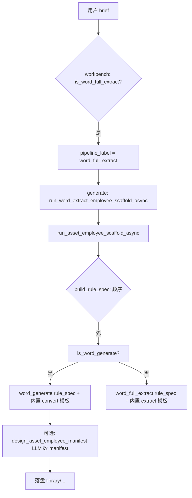

# Word 全量读取 ·「做员工」LLM 训练实验备忘

**会话** `6dcd5761d4ac4748945aed46` · **实验包** `word-full-read-employee-llm-lab`（`replace=false`，未覆盖 `word-full-read-employee`）  
**模型** xiaomi / mimo-v2.5-pro · **API** http://127.0.0.1:8765 · **耗时** ~12s · **编排** `word_full_extract` · **六维** 91 · **质量分** 100%

---

## 1. 结论（给训练/优化用）

| 维度 | 结果 |
|------|------|
| 编排是否跑通 | 是（14 步中 pack_only 跳过工作流） |
| 是否做出「可读 Word」员工 | **否** — 实际产物是 **Word 生成**（JSON→docx），不是全量读取 |
| 真实 .docx 冒烟（实验包） | **失败** — `仅支持 .json` |
| 真实 .docx 冒烟（黄金包） | **通过** — 写出 `document_full.json` + txt，2 个下载项 |
| 主要根因 | brief 未含「全量提取」→ `is_word_generate` 与 `is_word_full_extract` 同时为真；`build_rule_spec` **先匹配 generate**；generate 步走内置 `render_word_generate_convert_module()`，**非 MiMo 现场写 OOXML 解析代码** |

---

## 2. 实验包 vs 黄金包（结构）

| 项 | `word-full-read-employee`（黄金） | `word-full-read-employee-llm-lab`（实验） |
|----|-----------------------------------|-------------------------------------------|
| `rule_spec.runtime_kind` | `word_full_extract` | **`word_generate`** |
| `accepted_extensions` | `.docx`, `.doc` | **`.json`**（+ 模板 `.docx`） |
| 默认输出 | `outputs/document_full.json` | **`outputs/generated_document.docx`** |
| vendor 路径 | `backend/vendor/word_full_read/` | `backend/vendor/word_full_read_employee_llm_lab/` |
| `convert.py` 行数 | ~441（OOXML 解压 + 可选 python-docx） | ~197（**读 JSON，写 docx**） |
| manifest 能力 | `doc.full_extract` 等 | **`doc.generate` / template_merge** |
| panel 文案 | 上传 Word → JSON | **上传 JSON → 生成 Word**（与读取需求相反） |
| `created_by` | `asset_pipeline` | manifest 内混有 `employee_ai_scaffold` |

实验包 **有** `vendor/.../convert.py`（故 `has_convert_py` 在按 `word_full_read/` 路径扫描时会误报 false）；质检仍标 `word_full_extract` 管线，但 convert 扫描提示缺 `images` / `core_properties`（因实际是 generate schema）。

---

## 3. 「做员工」实际用了什么（诚实说明）

### 3.1 管线分叉



- **编排路由**看 `is_word_full_extract`（brief 里要有「提取/解析」+ Word 信号）。
- **包体 rule_spec** 看 `build_rule_spec()`，且 **`is_word_generate` 判断在 `is_word_full_extract` 之前**（`employee_asset_pipeline.py` ~393–396；`craft_steps.py` spec 步同理 ~160 vs 171）。
- 本次 lab brief 写的是「真实解析」「document_full.json」，**未写「全量提取」**，故 `is_word_generate` 未被 `WORD_GEN_EXCLUDE` 挡住，且因含 `document_full` + `输出` 等词命中 generate。
- **generate 步对 Word 提取**：优先 `render_word_generate_convert_module()` / `render_word_fallback_convert_module()`（**内置模板**），不是让 MiMo 从零写 400 行 OOXML 解析器。
- **MiMo 主要参与**：`spec` 步结构化提示、`design_asset_employee_manifest`（若未因 builtin 跳过）、`employee_plan` 等；本次 manifest 明显被 LLM 写成「生成员工」口吻。

### 3.2 与「训练 LLM 写代码」预期的差距

若目标是练 **docx→JSON 的 convert.py**：

1. 当前 happy path **不会调用** `generate_convert_with_llm()`（仅在非 builtin runtime 且需生成 convert 时）。
2. 即使用 MiMo，system prompt 偏「Excel/通用 convert」，且 max_tokens 有限，难以产出完整 Word 提取实现。
3. 应用 `SMOKE_EMPLOYEE_CASE=word` 的 `bootstrap_word_employee_packs.py` / 显式 brief 含 **「全量提取」** 才能稳定走 extract 分支。

---

## 4. 真实 .docx 冒烟（2026-05-28 本机 API）

使用与 `minimal_docx_bytes()` 等价的 ZIP（`ZIP_DEFLATED`）调用 `POST /api/employees/{id}/execute-file`。

| 员工包 | 结果 | 说明 |
|--------|------|------|
| `word-full-read-employee` | **PASS** | `direct_python` ok；`output_downloads` 2 |
| `word-full-read-employee-llm-lab` | **FAIL** | `不支持的文件类型：.docx，仅支持 .json` |

原始手工 docx（未 DEFLATE）对黄金包会报 `Bad magic number`（python-docx 先失败）；应用 runtime 自带 fixture 格式。

---

## 5. 训练/优化建议（8 条）

1. **Brief 契约**：做 Word **读取**员工时，brief 必须含「全量提取 / 仅提取 / extract」等排除 generate 的词；显式写 `runtime_kind: word_full_extract`，避免只写「解析 + document_full.json + 输出」。
2. **路由优先级**：在 `build_rule_spec` 与 `craft_steps.run_spec_step` 中，当 `is_word_full_extract(brief)` 为真时 **跳过** `is_word_generate`，或要求 generate 必须含「生成/写入」且不含「提取」。
3. **spec 与 generate 一致**：spec 步若标 `word_generate`，编排层应降级或失败，禁止 `pipeline_label=word_full_extract` 却落盘 generate 包（交叉校验 `rule_spec.runtime_kind`）。
4. **六维/质检加硬门**：`word_full_extract` 管线要求 `perception.accepted_extensions` 含 `.docx`、`default_output_relpath` 以 `.json` 结尾、convert 静态扫描含 `zipfile`/`OOXML` 或 `document_full.json` 写入；与 golden 包 diff 得分纳入 `domain_delivery`。
5. **若要练 LLM 写 convert**：增加开关 `force_llm_convert=true`，对 `word_full_extract` 禁用 builtin 模板，使用专用 system prompt（OOXML 字段清单 + 禁止 python-docx 单路径失败）；并提供 golden `convert.py` 作 few-shot 片段而非整包复制。
6. **manifest LLM**：`design_asset_employee_manifest` 的 user_msg 应注入 `rule_spec.runtime_kind` 且 **强制** perception/actions 与 rule_spec 一致；禁止把 read 需求写成 generate panel。
7. **实验脚本**：`run_word_read_employee_lab.py` 的 BRIEF 应加入「全量提取」；跑完后自动 `execute-file` docx，失败则 session 标 `error` 而非 `done`。
8. **评测集**：维护 `(brief, expected_runtime_kind, docx_pass)` 三元组；本案例期望 `(…全量提取…, word_full_extract, pass)`，实际 `(…真实解析…, word_generate, fail docx)`。

---

## 6. 复现命令

```bash
# 编排实验（不覆盖黄金包）
SMOKE_BASE_URL=http://127.0.0.1:8765 \
SMOKE_LLM_PROVIDER=xiaomi SMOKE_LLM_MODEL=mimo-v2.5-pro \
python3 scripts/run_word_read_employee_lab.py

# docx 冒烟（需先登录拿 token，或使用 execute-file）
python3 scripts/smoke_tabular_read_employees.py   # 含 word-full-read-employee；需在含 fastapi 的环境
```

产物路径：

- `artifacts/word_read_employee_lab_result.json`
- `artifacts/word_read_employee_lab.log`
- `library/word-full-read-employee-llm-lab/`

---

## 7. 下一步（产品/训练）

- 在 Shell 里打开实验包，对照黄金包改 `rule_spec` + 替换 vendor 为 `word_full_read` 或重跑 brief（含「全量提取」、`replace=false` 新 pack id）。
- 若要坚持「LLM 写码」训练：单独开 `llm_codegen_word_extract` 模式，与 asset_pipeline builtin 解耦，并记录每轮 convert diff 与 docx 冒烟结果。
