# yuangon AI 员工矩阵 —— 全流程闭环

> 版本：1.1.0 · 更新：2026-05-08

本文配合 [`yuangon/_shared/README.md`](../../yuangon/_shared/README.md) 使用，把 25 名 AI 员工组织成
一个**自循环**的工作流：用户/外部输入 → 自动派发 → 员工独立执行 → 自动审批 → 回流上岗 → 部署 → 观测。

**自动化打开步骤**：详见 [`runbooks/yuangon-automation-switch.md`](runbooks/yuangon-automation-switch.md)（git hook + 5 条 cron + 健康检查）。
**全覆盖归属表**：详见 [`yuangon/_shared/OWNERSHIP.md`](../../yuangon/_shared/OWNERSHIP.md)（每文件必有主或显式忽略）。

## 一、全景图

```mermaid
flowchart LR
  user["用户/外部输入<br/>(自然语言/邮件/微信/客服工单/.xcemp 候补包)"]
  user --> intake[intake-dispatcher]
  intake --> queue[("intake_tasks<br/>pending 队列")]
  queue --> router[task-router-officer]
  router -->|匹配 scope_globs| exec["业务员工<br/>(BE/FE/Vibe/DBA/Site/Mods/...)"]
  exec --> patch["change_requests<br/>submitted"]
  patch --> auditor[change-request-auditor]
  auditor -->|low/medium| approved["change_requests<br/>approved"]
  auditor -->|high| admin[admin 手批]
  admin --> approved
  approved --> deploy[deploy-release-officer]
  deploy --> live["生产/预发"]
  live --> obs["log-monitor-incident<br/>+ retention-officer"]
  obs -->|on_error/告警| router
  yuangon["yuangon/<br/>(yaml/skills/prompts 改动)"]
  yuangon --> resync[push-update-context-officer<br/>·skill-yuangon-resync]
  resync --> onboard["onboard_yuangon_employees.py<br/>+ sync_employee_trigger_bindings"]
  onboard --> router
  exec -. 触发 schema 变更 .-> dba[dbops-engineer]
  dba --> patch
```

## 二、事件总线

下表是闭环用到的核心事件（与 `triggers.subscribes` 一一对应）：

| 事件 | 发出方 | 主要订阅者 |
|------|--------|------------|
| `ops.intake.user_request` | Admin「下达任务」UI | intake-dispatcher |
| `ops.intake.customer_ticket` | AdminCustomerServiceView | intake-dispatcher |
| `ops.intake.candidate_pack` | mianshi/ 文件监听 | intake-dispatcher |
| `employee.task.done:wechat-contacts-ai-employee` | 微信员工 | intake-dispatcher |
| `ops.intake.task.queued` | intake-dispatcher | task-router-officer |
| `employee.task.assigned:<id>` | task-router-officer | 对应业务员工 |
| `ops.change_request.submitted` | 任意业务员工 | change-request-auditor |
| `employee.task.done:test-qa-runner` | test-qa-runner | change-request-auditor |
| `ops.change_request.approved` | change-request-auditor | deploy-release-officer |
| `ops.change_request.escalated` | change-request-auditor | admin |
| `yuangon.def.changed` | git hook / 文件监听 | push-update-context-officer |
| `ops.yuangon.resync.done` | push-update-context-officer | task-router-officer（重建路由表） |
| `employee.task.escalate:daily-orchestrator` | daily-orchestrator | dbops-engineer（schema 类） |

## 三、典型用户故事

### 故事 1：自然语言"修一下管理后台缺岗角标"
1. admin 在「下达任务」UI 输入 → `ops.intake.user_request`。
2. `intake-dispatcher` 归一化：`{intent: bugfix, files_hint: [market/src/views/AdminDutyEmployeesView.vue], risk: low}`。
3. `task-router-officer` 加载路由表 → 命中 `workbench-ux-stylist.scope_globs`（已扩展覆盖 `Admin*View.vue`） → 派发。
4. `workbench-ux-stylist` 出补丁 → `ops.change_request.submitted`。
5. `change-request-auditor` 跑测试 + 静态审 → 行数 < 100 + 无 forbidden 命中 + 测试全绿 → low → 自动放行。
6. `deploy-release-officer` 执行部署。
7. `log-monitor-incident` 24h 内无回滚信号 → 流程闭合。

### 故事 2：候选包入职
1. admin 把 `mianshi/foo-bar.xcemp` 投放到本目录 → `ops.intake.candidate_pack`。
2. `intake-dispatcher` 归一化 `{intent: onboarding, files_hint: [mianshi/foo-bar.xcemp]}`。
3. `task-router-officer` 仲裁规则 3 → 派给 `employee-interview-assistant`。
4. 访谈员产出 `yuangon/<area>/foo-bar/` 骨架 → `employee.task.done:employee-interview-assistant`。
5. 链式触发 `employee-pack-quality-interviewer` 做静态质询。
6. 通过则 admin 确认录用，跑 `onboard_yuangon_employees.py --pkg-ids foo-bar`。
7. 原 `.xcemp` 移到 `mianshi/_archived/` 并在该 README 决策表登记。

### 故事 3：yuangon 自定义改动回流
1. 任意员工修改 `yuangon/<area>/<id>/employee.yaml`（例如增加 scope_globs）。
2. git hook 发出 `yuangon.def.changed` 事件。
3. `push-update-context-officer.skill-yuangon-resync` 接住 → 调 `onboard_yuangon_employees --force --pkg-ids <id>` → `sync_employee_trigger_bindings_from_yuangon`。
4. 触发 `ops.yuangon.resync.done` → `task-router-officer` 重建路由表。
5. 整套链路 < 60s 内完成，磁盘与数据库不再漂移。

## 四、并发与冲突

- **同一文件改动同时被多人 scope 命中**：由 `task-router-officer.skill-arbitrate-overlap` 仲裁。
- **多个员工排队等同一资源**：`change_requests` 表的乐观锁 + 创建者分支隔离（每人在独立 branch 提交）。
- **跨员工依赖**：通过 `triggers.subscribes` 的事件链自然串联（不靠员工互相 import）。
- **高风险任务**：`change-request-auditor` 强制 escalate，admin 是最终仲裁人。

## 五、与现有 UI 的对应

| Admin UI 视图 | 对应数据表 | 主要负责员工 |
|--------------|------------|--------------|
| AdminDutyEmployeesView | `catalog_items` + `employees` | （UI 由 workbench-ux-stylist 维护） |
| AdminEmployeeChangeRequestsView | `change_requests` | change-request-auditor |
| AdminYuangonOnboardView | `yuangon/**/employee.yaml` | employee-interview-assistant + employee-pack-quality-interviewer |
| AdminCustomerServiceView | `customer_tickets` | intake-dispatcher（接入） |
| AdminOpsAuditView | `dispatch_log` + 审计事件 | task-router-officer（写）+ change-request-auditor（写） |
| AdminDatabaseView | DB 元数据 | dbops-engineer |

## 六、未决与已知

- **DB-001（dbops 第一单）**：`employee_trigger_bindings.priority` 列缺失。详见 [`yuangon/server-and-ops/dbops-engineer/runbook.md` §已知未决工单](../../yuangon/server-and-ops/dbops-engineer/runbook.md)。第一次跑通 yuangon_resync.py --apply 时已捕获并写入工单。
- **路由表自动重建**：✅ 已实装 `scripts/build_routing_table.py`，由 task-router-officer 的 cron（03:00）+ ops.yuangon.resync.done 事件双路触发。当前已生成 `docs/routing-table.md` + `modstore_server/data/routing_table.json`。
- **事件总线后端**：当前事件落到 `event_outbox.jsonl`（已验证 `ops.yuangon.resync.done` 写入成功）；后续可接 Redis Streams 实现真正的发布订阅。
- **邮件桥接器**：`ops.intake.email` 是预留事件，待 admin 提供 IMAP 账户后由 intake-dispatcher 接入。
- **客服工单桥接**：`ops.intake.customer_ticket` 同样待 AdminCustomerService 表接通后由 intake-dispatcher 监听。

## 七、变更记录

| 日期 | 变更 | 操作人 |
|------|------|--------|
| 2026-05-08 | v1.0.0：闭环图 + 事件总线 + 3 个用户故事 | admin |
| 2026-05-08 | v1.1.0：全覆盖（OWNERSHIP.md, 81,265 文件全部命中）+ 5 条 cron + git pre-push/post-commit hook + 4 个自动化脚手架（build_routing_table.py / yuangon_resync.py / intake_watcher.py / coverage_audit.py） | admin |
