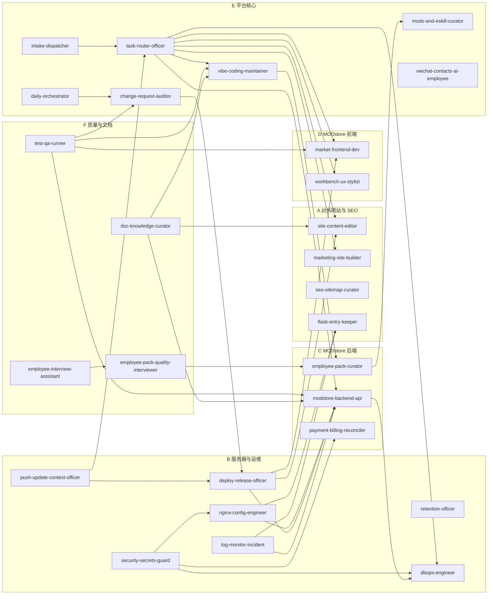

# yuangon/ AI 员工矩阵总览

> 成都修茈科技有限公司 · AI 员工部署规划  
> 版本：1.4.0 · 更新：2026-05-08

> **配套文档**：
> - [`OWNERSHIP.md`](./OWNERSHIP.md) — 全仓库 81,265 文件的归属表（每文件必有主或显式忽略）
> - [`MODstore_deploy/docs/yuangon-process-loop.md`](../../MODstore_deploy/docs/yuangon-process-loop.md) — 闭环流程图与事件总线
> - [`MODstore_deploy/docs/runbooks/yuangon-automation-switch.md`](../../MODstore_deploy/docs/runbooks/yuangon-automation-switch.md) — 自动化总开关 / cron 计划表 / 健康检查

---

## 矩阵全图（26 人 + 1 已有）



---

## 责任矩阵一览

| # | 员工 ID | 中文名 | 分区 | 核心资产（Glob 摘要） | 禁区摘要 |
|---|---------|--------|------|-----------------------|----------|
| 1 | `site-content-editor` | 静态站内容编辑员 | site-and-marketing | `*.html`（营销页）、`news.json`、`activities.json`、`styles.css`、`main.js` | `app.py`、`MODstore_deploy/**`、`nginx-*.conf` |
| 2 | `seo-sitemap-curator` | SEO/站点地图管理员 | site-and-marketing | `sitemap.xml`、`robots.txt`、`baidu_urls.txt`、`BingSiteAuth.xml`、`baidu_verify_*.html` | 业务代码，只动 SEO 资产 |
| 3 | `flask-entry-keeper` | Flask 入口维护员 | site-and-marketing | `app.py`、`requirements.txt`、`public/`、`uploads/`、`excel-to-ai.html` | `MODstore_deploy/**`、`nginx-*.conf` |
| 3.1 | `marketing-site-builder` | 营销站点构建员 | site-and-marketing | `marketing-site/**` | `MODstore_deploy/**`、`site/**` |
| 4 | `nginx-config-engineer` | Nginx 配置工程师 | server-and-ops | `nginx-xiu-ci.conf`、`nginx-xiu-ci-root.conf`、`nginx-default.conf` | 所有业务代码 |
| 5 | `deploy-release-officer` | 发布部署主管 | server-and-ops | `deploy/`、`scripts/`、`docker/`、`dist/`、`setup-alipay.sh`、`stop_ports.py` | `_local_secrets/`（只读引用，不写） |
| 5.1 | `push-update-context-officer` | 推送更新员工 | server-and-ops | `deploy/`、`scripts/`、`.github/`、`.env.example` | `_local_secrets/`、`*.vue`、`vibe-coding/src/**` |
| 6 | `security-secrets-guard` | 安全密钥守卫 | server-and-ops | `_local_secrets/`、`.cursor_admin_token.txt`、支付证书、依赖 CVE 扫描 | 禁止输出 secrets 明文 |
| 7 | `log-monitor-incident` | 日志监控与事故员 | server-and-ops | `coverage/`、`playwright-report/`、`test-results/`、`.cursor_*_log.txt` | 禁止改动源码 |
| 8 | `modstore-backend-api` | MODstore 后端 API 员 | modstore-backend | `workbench_api.py`、`market_api.py`、`market_catalog_api.py`、`script_workflow_api.py`、`realtime_ws.py`、`llm_*.py` | `market/src/**`（前端） |
| 9 | `employee-pack-curator` | 员工包策展员 | modstore-backend | `employee_ai_*.py`、`employee_pack_*.py`、`employee_skill_register.py`、`employee_executor.py`、`*.xcemp`、`docs/fhd-employee-composition.md`、`docs/modstore/员工制作增强设计方案.md` | 不得修改 payment 模块 |
| 10 | `payment-billing-reconciler` | 支付账单对账员 | modstore-backend | `payment_*.py`、`llm_billing.py`、`subscription_renewer.py`、`alipay_package/` | 禁止直接写 DB，只读对账 |
| 11 | `market-frontend-dev` | 市场前端开发员 | modstore-frontend | `market/src/views/`（非 workbench）、`market/src/api.ts`、`infrastructure/http/client.ts` | 禁止引入 React；禁碰后端 |
| 12 | `workbench-ux-stylist` | 工作台 UX 设计员 | modstore-frontend | `market/src/views/workbench/**`、`CanvasStage.vue`、`RightRail.vue`、`WorkbenchShell.vue`、`EmployeeAiDraftReview.vue` | 同上，纯 Vue 3 |
| 13 | `vibe-coding-maintainer` | Vibe-Coding 维护员 | platform-core | `vibe-coding/src/vibe_coding/`、`vibe-coding/tests/` | 不得改动 MODstore 后端接口 |
| 14 | `mods-and-eskill-curator` | Mods/ESkill 策展员 | platform-core | `mods/`、`eskill-prototype/`、`market_files/*.xcemp` | 不直接上线，需经 CI 审批 |
| 14.1 | `daily-orchestrator` | 每日编排员 | platform-core | `MODstore_deploy/market/src/**`、`MODstore_deploy/modstore_server/**`、`MODstore_deploy/tests/**` | `models.py`、`migrations/**`、`alembic/**`（归 dbops-engineer）、用户数据目录 |
| 14.2 | `intake-dispatcher` | 需求接入员 | platform-core | `eventing/intake/**`、`api/intake_api.py`、`mianshi/**` | 业务源码、payment、models.py |
| 14.3 | `task-router-officer` | 任务派发员 | platform-core | `eventing/router/**`、`scripts/build_routing_table.py`、`docs/routing-table.md` | 员工包源码（归 employee-pack-curator） |
| 14.4 | `change-request-auditor` | 变更评审员 | platform-core | `api/change_request_api.py`、`scripts/audit_*.py`、`docs/runbooks/change-request-audit.md` | 不直接合并到主干、不动 secrets |
| 15 | `test-qa-runner` | 测试质量运行员 | quality-and-docs | `MODstore_deploy/tests/`、`vibe-coding/tests/`、`playwright.config.ts`、`.pre-commit-config.yaml` | 禁止修改被测源码 |
| 16 | `doc-knowledge-curator` | 文档知识管理员 | quality-and-docs | `README.md`、`ESkill.md`、`docs/`、`*.md` 文档层、各员工 README、变更信号感知 | 禁止修改源码 |
| 17 | `employee-interview-assistant` | 员工信息访谈员 | quality-and-docs | `yuangon/**/README.md`、`employee.yaml`、`runbook.md`、`skills/*.md`、`tasks/**` | secrets / payments |
| 18 | `employee-pack-quality-interviewer` | 员工包质询员 | quality-and-docs | `yuangon/**/employee.yaml`、`prompts/*.md`、`skills/*.md` | secrets |
| 19 | `retention-officer` | 档案清理员 | server-and-ops | `workbench_script_runs/**`、`webhook_events/**`、临时/历史目录（`__tmp_xcemp/`、`new/`、`alipay_package/`、`taiyangniao-pro/` 等） | `MODstore_deploy/modstore_server/**/*.py`、`market/src` 与 `vibe-coding/src` 业务源码、`.env*`、secrets |
| 20 | `dbops-engineer` | 数据库运维工程师 | server-and-ops | `models.py`、`alembic/**`、`migrations/**`、`db.py` | `.vue/.ts`、`market/src/**`、`*.db` |
| ★ | `wechat-contacts-ai-employee` | 微信联系人 AI 员工 | platform-core | （已有，原地保留） | — |

---

## 骨架约定（每个员工目录）

```
<employee-id>/
  employee.yaml      # 元数据：id/domain/scope_globs/triggers/sla
  README.md          # 职责/典型任务/KPI/禁区
  runbook.md         # 巡检/异常处置/ESkill 动态记录
  skills/
    skill-<name>.md  # ESkill 四阶段描述（可多个）
  prompts/
    system.md        # 系统提示词
    task.*.md        # 典型任务提示词模板
  tasks/
    example-input.json   # 任务输入 schema 示例
```

模板源文件（本目录）：

| 模板文件 | 用途 |
|----------|------|
| `employee.template.yaml` | 员工元数据模板 |
| `skill.template.md` | ESkill 四阶段描述模板 |
| `runbook.template.md` | 巡检/事故 Runbook 模板 |

---

## 使用说明

1. **制作新员工**：拷贝 `_shared/employee.template.yaml` 到新员工目录 → 填写 `id/domain/scope_globs/forbidden_globs` → 补写 `README.md`。
2. **添加新 Skill**：拷贝 `_shared/skill.template.md` 到 `<employee>/skills/` → 填写 4 阶段逻辑。
3. **入职与上架**：`yuangon/` 中的目录与 `employee.yaml` 仅表示**编制与职责规划**，**不等于**已在 MODstore 上岗。将员工包登记进目录、在「在岗员工」中可见，须经内部约定的 **面试 / 录用 / 审批** 流程后，由有权人员在产品内完成（例如工作流脚手架登记、授权上架等）。**禁止**为消除管理后台「缺岗」提示而批量把仓库定义扫入数据库。新候选包先放 [`mianshi/`](../../mianshi/README.md) 走面试流程，录用后再落地到 `yuangon/<area>/<id>/`。
4. **ESkill 固化**：动态阶段成功后，在 Runbook 动态记录表中追加记录，并递增 `employee.yaml` 中的版本号，创建新版 skill md。
5. **闭环流程**：完整的「需求接入 → 派发 → 执行 → 审批 → 回流 → 部署」闭环见 [`MODstore_deploy/docs/yuangon-process-loop.md`](../../MODstore_deploy/docs/yuangon-process-loop.md)。
